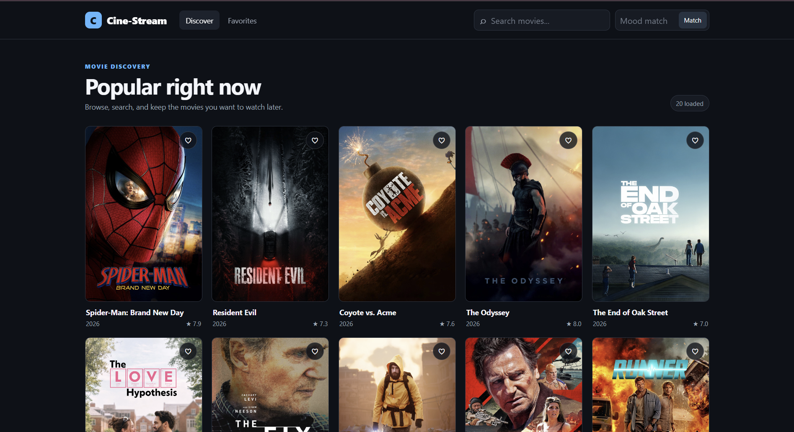
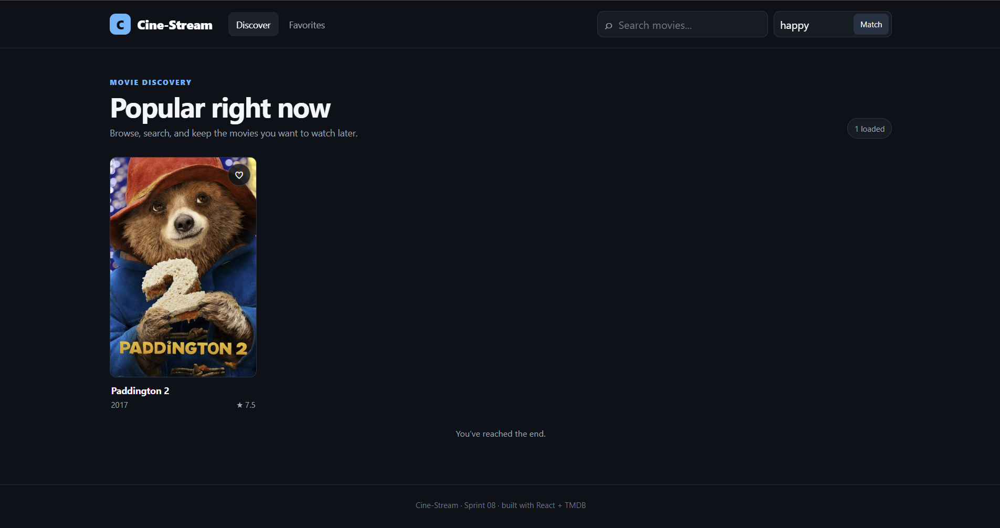

# 📸 Cine-Stream

Cine-Stream is a responsive movie discovery web application built as an
internship Sprint 08 project. It uses the TMDB API to display popular
movies, supports movie search, infinite scrolling, favorites, and an
AI-based Mood Matcher for finding a movie based on the user's mood.

The project is built with React and Vite and is designed to work on
desktop, tablet, and mobile screens.
---

## 🚀 Live Demo
👉 Cine-Stream Live Website:(https://cine-stream-kiff.vercel.app/)

---
📸 Project Screenshot & Video
### Desktop Preview


### Mood-matcher Preview

---

## ✨ Features

- Browse popular movies from TMDB
- Search movies with a 500ms debounce
- Infinite scrolling using IntersectionObserver
- Movie cards with:
- -Poster
- -Movie title
- -Release year
- -Rating
- Favorite button
- Favorites stored in localStorage
- Dedicated Favorites page
- Native lazy loading for movie posters
- Fallback UI when a movie poster is unavailable
- AI Mood Matcher using Gemini
- Responsive layout for desktop, tablet, and mobile

---

##  Tech Stack

- React
- Vite
- JavaScript
- CSS
- Axios
- TMDB REST API
- Google Gemini API
- React Router
- Local Storage
- Vercel
---

## 📂 Project Structure
```
cine-stream/
├── api/
│ └── mood.js
│
├── public/
│
├── src/
│ ├── components/
│ │ ├── LoadingGrid.jsx
│ │ └── MovieCard.jsx
│ │
│ ├── hooks/
│ │ └── useDebounce.js
│ │
│ ├── pages/
│ │ ├── Favorites.jsx
│ │ └── Home.jsx
│ │
│ ├── services/
│ │ ├── mood.js
│ │ └── tmdb.js
│ │
│ ├── App.jsx
│ ├── main.jsx
│ └── styles.css
│
├── .env.example
├── .gitignore
├── package.json
├── Prompts.md
├── README.md
└── vite.config.js
```
---